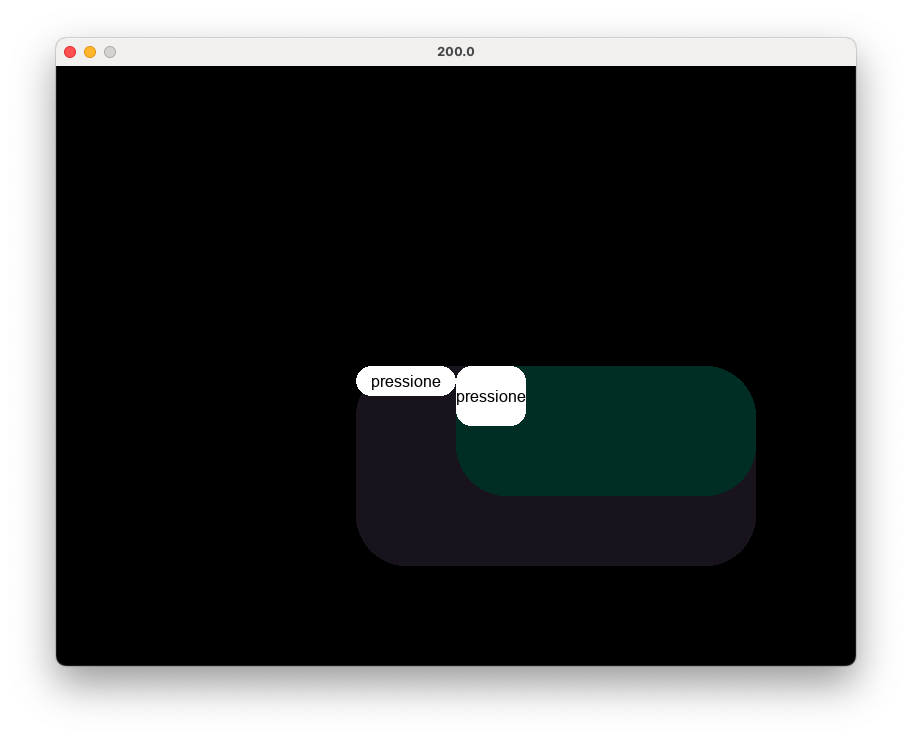

Sistema Operacional Baseado em python
====
desenvolvido para performar programas em [*asm*](#atualmente-conta-com-as-seguinte-instruções) baseado em ISA virutal, como em um emulador , porem com aplicações praticas. E um script para automações , o [`JA Script`](#ja-script)

## atualmente conta com as seguinte instruções:

- `mov` ; registradores de `a` até `h`

### move valores para registradores diversos sem limitações

``` asm
mov "#string diversa" rax
mov b c
mov $10 a 
halt
```

- `add`, `sub`, `div`, `mul` (operadores __Matematicos__)

### fazem as operações logicas principais

``` asm
mov $0 a
add $5 a b
>"b é o resultado"
sub $2 a c
...
halt
```

- `AND`, `NOT`, `OR` e `XOR` (operadores __Logicos__)

### operações logicas
``` asm 
AND $10 $10 a
> "compara os dois valores e retorna em a"
halt
```

- load , store (memoria)

```asm
store $10 a
> "armazena no endereço 10 o valor de a"
load $10 a
> "substitui valor de a por o que estiver no endereço 10" 
halt
```

- `set` , `ret` , `call` , `module` (modularidade)

vamos supor que foi criadado uma. função simples , hipotenusa do endereço 10 e 11 como catetos:
> matematica.asm
``` asm
set $8 "#hipotenusa"
load $10 a
load $11 b
mul a a a_quadrado
mul b b b_quadrado
add a_quadrado b_quadrado c
root c 2 c_final
store $12 c
ret
halt
```

a instrução `set` tem uma sintaxe simples

``` asm
set $<tamanho da função> <nome da função>
...
ret
halt
```

o uso de ret no final de cada função é obrigatorio , tendo em vista que significa o final no ponteiro da função, sendo equivalente ao `halt`

### Mas ...
agora voce precisa importar essa função para seu codigo em __outro arquivo__

> projeto.asm
``` asm
module "#matematica.asm"
store $10 4
store $11 3
call "#matematica.hipotenusa"
mov $0 rax
load $12 b
syscall
>"rax=0 , printa informação de b no terminal"
halt
```

- `point` e `loop_p` (loops )

esta cansado de usar jumps comparativos de forma tão intensa ? agora tem uma alternativa , que se assimila ao `goto` do `batch`, voce declara um ponteiro `point "#ponto"` , mas sem descartar totalmente `jmp` e suas **`variantes`**

> comparativo.asm
``` asm
mov $10 h
point "#pontao"
add $20 h
cmp h 310
jnz $1
loop_p "#pontao"
halt
```

# Layout baseado em `JSON` + `CSS`

Surgiu da ideia de fazer uma interface que seja manipulavel de forma conhecida dentro da programação, como `array` e `dicionarios`, apresentando sintaxe simples e intuitiva, com pequenas excessões.

### Exemplo de UI

```json
{
    'corpo': {
        'value': '',
        'style': {
            'size': [400, 200], 
            'border radius': 50, 
            'background': [70, 50, 80, 100], 
            'position': [300, 300]},
        'type': 'Box'
        ,'child': {
            'butao1': {
                'style': 
                {'border radius': 15, 
                'size': [100, 30], 
                'color': [0, 0, 0], 
                'background': [255, 255, 255]}, 
                'type': 'Button', 
                'value': 'pressione'
                },
            'blocos': {
                'style': 
                {'size': [300, 130], 
                'border radius': 50, 
                'background': [2, 50, 40], 
                'position': [0, 0]},
                'type': 'Box',
                'value': '',
                'child': {
                    'butao1': {
                        'style': 
                        {'border radius': 15, 
                        'size': [70, 60], 
                        'color': [0, 0, 0], 
                        'background': [255, 255, 255]}, 'type': 'Button', 
                        'value': 'pressione'}
                }
            }
        }
    }
}
```
### que vira :


<video src="demo_UI2.mov" width="600" controls.>
  Seu navegador não suporta a tag de vídeo.
</video>

É possivel notar que os atribuitos de cada elemento são declarados em um dicionario `style`, com parametros comuns , como **size** ; **position** ; **color** ; **background** ; **border radius**

É importante lembra que os objetos `herdam` as propriedades do `objeto pai`


# JA Script
